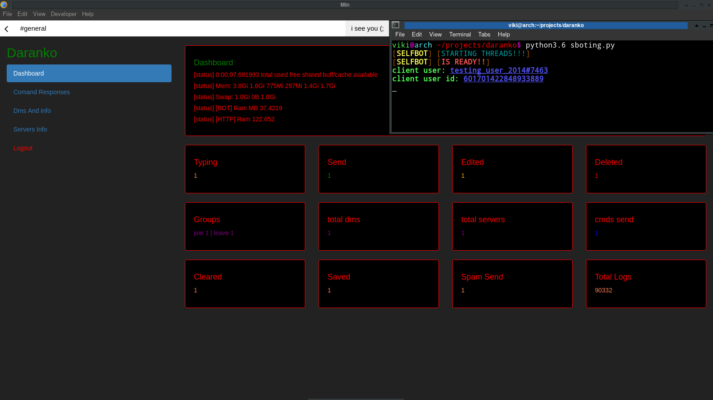
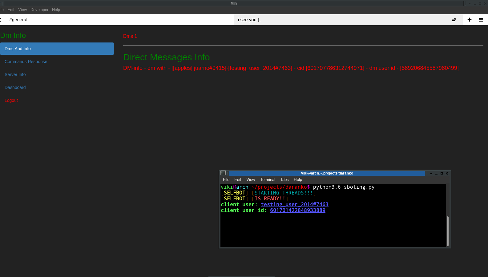
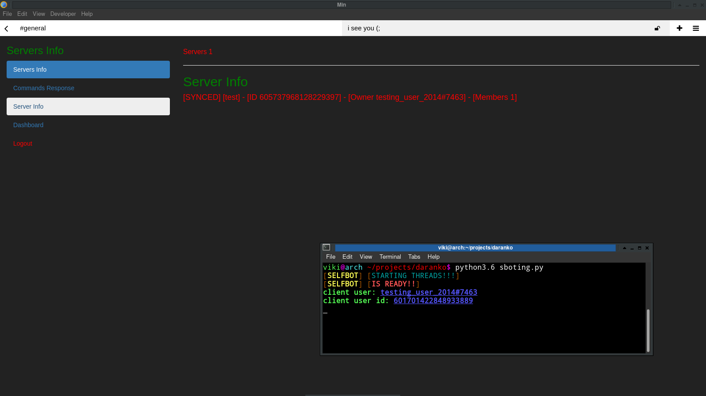
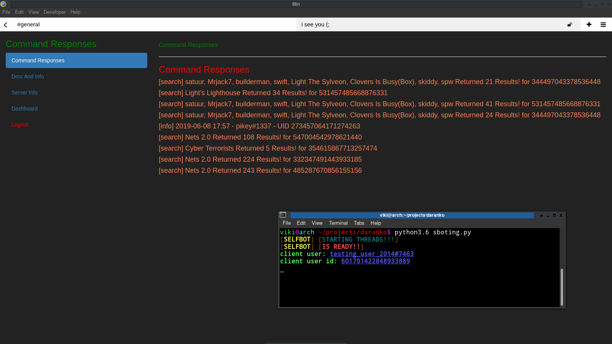

# daranko

### daranko Selfbot Is a selfbot focused on loging messages and utilizing the messages on a advanced logging lvl

## Table of contents
* [Usage](#Usage)
* [Webpanel](#Webpanel)
* [Screenshots](Screenshots)
* [License](#License)

## install
run installs

that should install everything needed after that continue with the steps

# Usage
1. Change token in the daranko.py at bottom of file
2. In the selfbot folder type [python3.6 daranko.py] to start the bot
3. to synchronise the needed data run the bot once with [python3.6 daranko.py sync] to get all needed data but open all private channels first like open the chats dont message them just open them and run it then with sync if not stuff might not work out well!!

### if your in many servers it might take a long time and a posible retry if it fails your specs are to low and need to upgrade or simply leave a lot of servers... );

# Webpanel
1. change password in /var/www/html/panel/login.php | line 6 [password] [username]
2. reboot apache | apachectl retart
3. apt install unicode

## info
the web pannel to view needed info
like dm channels and responses of commands excuted in discord
connected servers
stats of the bot and server usages
uptime you name it

## screenshots

## License
[GPL-3](https://www.gnu.org/licenses/gpl-3.0.en.html)

    <darank is a discord selfbot that logs messages and a lot more.>
    Copyright (C) <2019>  <decoding9>

    This program is free software: you can redistribute it and/or modify
    it under the terms of the GNU General Public License as published by
    the Free Software Foundation, either version 3 of the License, or
    (at your option) any later version.

    This program is distributed in the hope that it will be useful,
    but WITHOUT ANY WARRANTY; without even the implied warranty of
    MERCHANTABILITY or FITNESS FOR A PARTICULAR PURPOSE.  See the
    GNU General Public License for more details.

    You should have received a copy of the GNU General Public License
    along with this program.  If not, see <https://www.gnu.org/licenses/>.
